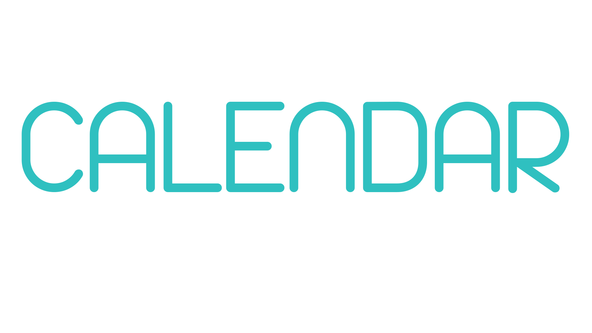

  

## Overview

This project is a single-page web application for managing events on a calendar. It allows users to create, view, and edit events with various details. The application uses HTML, CSS, and TypeScript for the frontend logic. Events are stored in the browser's localStorage for persistence across page reloads.

## Features

- **Header**
  - Displays the project name.
  - Contains a button to add a new event, which opens a modal window.

- **Modal**
  - Allows users to create a new event with the following details:
    - Title 
    - Initial Date with time 
    - Optional end date (checkbox)
        - Displays a new input to add the end date if checked
    - Calculates and displays the duration between start and end date
    - Reminder (checkbox)
    - Event description
    - Type of event (predifined options)
  - Closes via close button, clicking outside, pressing Escape key or clicking on any day.

- **Calendar**
  - Displays one month at a time.
  - Shows the current month by default.
  - Highlights today's date.
  - Provides buttons to navigate to the next or previous month.
  - Each day can be double-clicked in order to open the modal.
  - Displays event titles and indicates if there are any events on a day.
  - Hovering over an event will alow removal
  - Theme toggle between light and dark mode.

## Implementation Details

- **Technologies**
  - HTML5, CSS3, TypeScript
  - No third-party libraries used.

- **Validation**
  - Field validation occurs on blur.
  - Error messages are removed when the field gains focus again after resolution.

- **Responsive Design**
  - The application is designed to be responsive across different device sizes.

- **Accessibility**
  - Modals support keyboard navigation (TAB and SHIFT + TAB).

- **LocalStorage**
  - Events are stored in the browser's localStorage for persistence.

- **Git and GitHub**
  - The project uses Git for version control with proper commit messages following best practices.

## Conclusion

This project demonstrates the implementation of a feature-rich calendar application using semantic HTML5 elements and responsive design techniques. It incorporates user-friendly modals for event creation and details viewing/editing. The project adheres to best practices for code organization and version control. Additionally, it utilizes localStorage for data persistence, ensuring a seamless user experience even after page reloads.

## Preview

